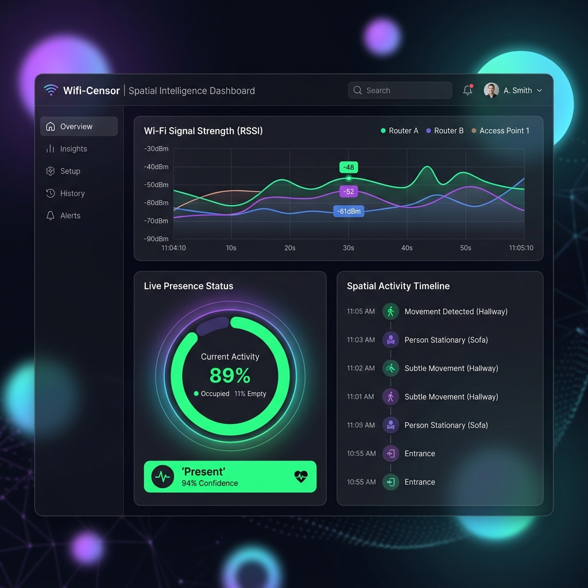

# 📡 Wifi-Censor

> **Invisible Spatial Sensing** — Biến ngôi nhà thành môi trường cảm biến thông minh chỉ với điện thoại và router Wi-Fi có sẵn.

[](LICENSE)
[](https://github.com/9dpi/wifi-medical/actions)
[](https://9dpi.github.io/wifi-medical/)
[](https://developer.android.com)
[](docs/privacy.md)

---

## 🌐 Web Dashboard Demo & Live Site

Hệ thống Web Dashboard được lưu tại thư mục `/docs` và tự động deploy qua **GitHub Pages**. Bạn có thể truy cập trực tiếp tại:

👉 **Live Dashboard:** [https://9dpi.github.io/wifi-medical/](https://9dpi.github.io/wifi-medical/)

### Giao Diện Dashboard (Dark Glassmorphism)

Dưới đây là hình ảnh demo mô phỏng giao diện web với các thông số đo đạc thời gian thực từ tín hiệu Wi-Fi RSSI:



---

---

## 🎯 Tính năng

### 📱 Phiên bản Android App (MVP 1)
| Tính năng | Trạng thái | Mô tả |
|-----------|-----------|-------|
| 🟢 Phát hiện hiện diện | ✅ Hoàn thành | Phát hiện có/vắng người qua phương sai RSSI |
| 🚶 Phân loại hoạt động | ✅ Hoàn thành | Đi lại / ngồi yên / ngủ (với ngưỡng siêu nhạy ngủ tĩnh lặng) |
| ⚠️ Cảnh báo bất động | ✅ Hoàn thành | Cảnh báo khi người dùng không di chuyển > 45 phút |
| 🔴 Phát hiện té ngã | ✅ Hoàn thành | Nhận dạng rơi tự do thông qua suy giảm tín hiệu đột ngột |
| 🌐 Web Dashboard | ✅ Hoàn thành | Đồng bộ hóa dữ liệu JSON qua GitHub Pages / Google Drive |

### 💻 Phiên bản Desktop Guard (MVP 2 - Hệ Thống Trực Giám Sát & Trợ Lý Y Tế AI)
| Tính năng | Trạng thái | Mô tả |
|-----------|-----------|-------|
| 🖥️ Giao diện Retro | ✅ Hoàn thành | CustomTkinter GUI phong cách Windows 98 cổ điển, hỗ trợ thu nhỏ khay hệ thống (System Tray) |
| 🤖 Trợ lý Y tế AI | ✅ Hoàn thành | Chat bot cục bộ hỗ trợ mô hình Ollama (Gemma4, Llama3) với cơ chế ReAct Loop gọi công cụ |
| 🩺 Ghi chép bất thường | ✅ Hoàn thành | Cho phép người dùng báo cáo nhanh sai lệch dữ liệu, báo động lỗi vào tệp cục bộ |
| 🚨 AI Fall Verifier | ✅ Hoàn thành | Thu thập 10s dữ liệu sau cú va chạm, gửi AI phân tích và đưa ra phán quyết giảm tối đa báo động giả |
| 🛠️ Kỹ năng AI tùy biến | ✅ Hoàn thành | Cho phép thêm mới thói quen uống thuốc, liên hệ khẩn cấp động từ Settings Tab dạng function calling |
| 🔍 Tìm kiếm Internet | ✅ Hoàn thành | Công cụ tìm kiếm tích hợp thu thập dữ liệu thời gian thực và kiến thức y học qua Yahoo Search scraper |
| 📄 Báo cáo Sức khỏe | ✅ Hoàn thành | Tự động tổng hợp dữ liệu sinh hiệu và xuất báo cáo PDF cuối ngày lúc 21:00 có lời khuyên của AI |
| 🪵 Nhật ký Log toàn cục | ✅ Hoàn thành | Module ghi log xoay vòng `wificensor.log` (5MB giới hạn) thread-safe giám sát toàn bộ hoạt động |

---

## 🏗️ Kiến trúc Hệ thống

```
📱 Android App (Kotlin + Compose) & 💻 Desktop Guard (Python + CustomTkinter)
├── WifiScanner          → Quét & đo đạc cường độ sóng RSSI (pywifi / netsh)
├── PresenceEngine       → Thuật toán lọc phương sai & phân loại hoạt động
├── AnomalyTracker       → Phát hiện bất thường cục bộ (té ngã, bất động)
├── Database (SQLite)    → Lưu trữ lịch sử sinh hiệu, RSSI và cảnh báo
├── Exporter (JSON)      → Xuất trạng thái snapshot thời gian thực thích hợp với Web
└── GitHub Sync Manager  → Đồng bộ hóa đám mây hai chiều & điều khiển từ xa

🤖 Local AI Agent Engine (Ollama Integration)
├── OllamaManager        → Quản lý sức khỏe dịch vụ, tự chọn mô hình tối ưu nhất
├── ToolExecutor         → Thực thi công cụ (Truy vấn sinh hiệu, Cảnh báo người thân, Độ nhạy)
├── Custom Skills Engine  → Đăng ký dynamic function từ custom_skills.json qua GUI
├── Yahoo Search Scraper → Thu thập kiến thức thời gian thực không cần API key
├── FallVerifier AI      → Bộ xác nhận ngã hai giai đoạn giảm false alarm cực kỳ nhạy
└── ReportGenerator AI   → Tổng hợp dữ liệu y tế ngày và biên soạn báo cáo PDF tự động
```

---

## 🚀 Cài đặt & Vận hành nhanh

### Yêu cầu hệ thống
- **Android:** Phiên bản Android 8.0+
- **Desktop:** Windows OS, Python 3.10+, hoặc chạy trực tiếp file Executable đóng gói.
- **Trợ lý AI:** Đã cài đặt dịch vụ **Ollama** cục bộ (đã tải mô hình như `gemma`, `llama3`).

### Hướng dẫn chạy Phiên bản Desktop (MVP 2)

1. Clone repo và cài đặt các thư viện cần thiết:
   ```bash
   git clone https://github.com/9dpi/wifi-medical.git
   cd wifi-medical
   pip install -r requirements.txt
   ```

2. Khởi động dịch vụ Ollama (nếu chưa chạy nền). Ứng dụng sẽ tự động kích hoạt tiến trình Ollama nền nếu tìm thấy đường dẫn mặc định.

3. Khởi chạy ứng dụng:
   ```bash
   python desktop/main.py
   ```

4. Chạy kiểm thử các tính năng AI & Tích hợp (Logs, Skills, Internet Search):
   ```bash
   python C:\Users\Admin\.gemini\antigravity\brain\95b91978-77d9-42f2-8c85-06cc62768bcc\scratch\test_ai_features.py
   python desktop/test_e2e_bio.py
   python test_e2e.py
   ```

---

## 📁 Cấu trúc thư mục

```
Wifi-Censor/
├── app/                          # Mã nguồn ứng dụng Android App (MVP 1)
├── desktop/                      # Mã nguồn ứng dụng Desktop Guard (MVP 2)
│   ├── app/                      # Các Module logic cốt lõi
│   │   ├── ai/                   # Trợ lý AI (Agent, Tools, FallVerifier, ReportGenerator)
│   │   ├── config.py             # Quản lý cài đặt & cấu hình chỉ số y tế
│   │   ├── database.py           # Lưu trữ cơ sở dữ liệu SQLite lịch sử 30 ngày
│   │   ├── logger.py             # Hệ thống Log xoay vòng toàn cục
│   │   ├── presence_engine.py    # Thuật toán phân tích sóng vắng/có người & ngủ
│   │   └── scanner.py            # Wi-Fi scanner đa chế độ (pywifi / netsh)
│   ├── ui/                       # Giao diện người dùng CustomTkinter (Windows 98 Style)
│   │   ├── components/           # Các widget dùng chung (AlertBanner)
│   │   ├── app_window.py         # Cửa sổ chính, điều phối và System Tray
│   │   ├── settings_tab.py       # Cấu hình chỉ số y tế & Quản lý kỹ năng AI
│   │   └── ai_chat_tab.py        # Tab hội thoại với Trợ lý Y Tế AI
│   ├── main.py                   # Điểm khởi chạy ứng dụng chính (Main Entry Point)
│   └── test_e2e_bio.py           # Test suite liên thông sinh hiệu & cảm biến
├── docs/                         # Giao diện Web Dashboard (GitHub Pages)
└── README.md                     # Tài liệu giới thiệu tổng quan dự án
```

---

## 🛡️ Quyền riêng tư

- ✅ **Local-first**: Tất cả xử lý trên thiết bị
- ✅ **No cloud**: Raw RSSI data không bao giờ rời khỏi điện thoại
- ✅ **Minimal sync**: Chỉ kết quả phân tích (JSON text) được sync — không có audio, video, location GPS
- ✅ **Open source**: Code hoàn toàn minh bạch

---

## License

This project is licensed under the Apache License, Version 2.0 - see the [LICENSE](LICENSE) file for details.

Copyright 2025 - 2026 Vu Quang Cuong. All rights reserved.
